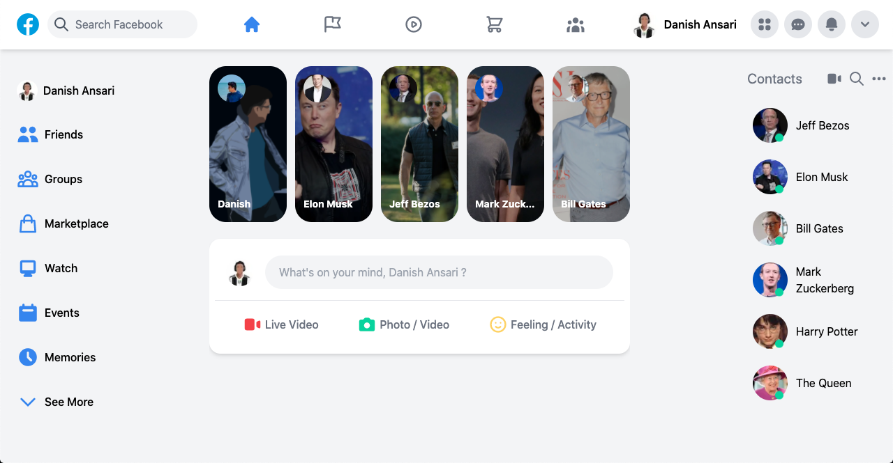
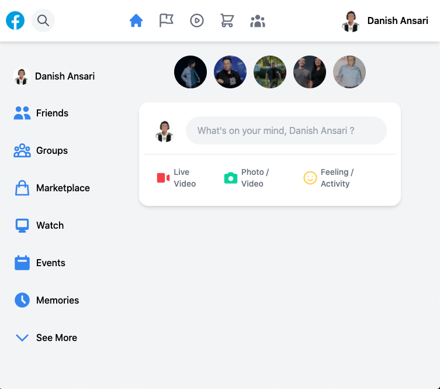
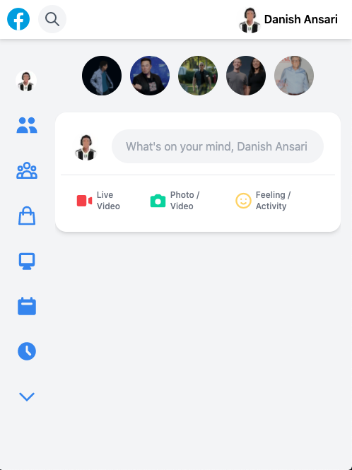

# LinkedIn Clone 

 

A fully functional Facebook clone made using

* `Next.js`
* `React`
* `Tailwind CSS`
* `Firebase`
* `Facebook Login`
* `Image Uploading`

 

---
* This Web app is fully responsive made using Tailwind CSS. 

* You can add real-time posts and include pictures in it.

---

### Installation

* Clone this repositiory.

* Open terminal and type `npm run dev` or `yarn run dev`

---

### Preview
 

Large Screen:  

  

 

Medium Screen: 

  

 

Small Screen: 

  

 

---

 

Check out my <a href="https://danishansari.dev/">website</a>.

 

---

<b>Enjoy!</b>

---